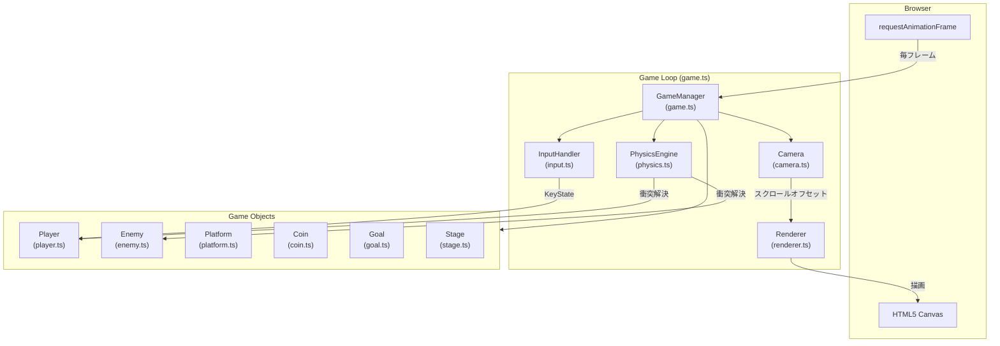
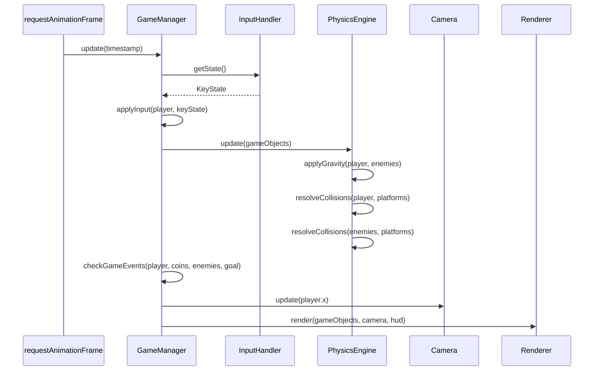

# Design Document

## Overview

本ドキュメントは、スーパーマリオブラザースにインスパイアされたシンプルな2D横スクロールプラットフォームゲームの技術設計を定義する。

### 技術スタック

- **言語**: TypeScript（型安全性・モジュール管理のため）
- **レンダリング**: HTML5 Canvas 2D API（外部エンジン不使用のバニラ実装）
- **ビルドツール**: Vite（高速な開発サーバー・ESModule バンドル）
- **テスト**: Vitest + fast-check（プロパティベーステスト）
- **実行環境**: モダンブラウザ（Chrome / Firefox / Safari）

### 設計方針

- 外部ゲームエンジンを使わないバニラ実装とし、1週間スコープに収める
- 各コンポーネント（Player、Physics、Camera など）を独立したファイルに分離し、責務を明確化する
- ゲームループは `requestAnimationFrame` を使用し、60fps を目標とする
- 衝突判定は AABB（Axis-Aligned Bounding Box）方式で実装する

---

## Architecture

### システム全体構成



### ゲームループのフロー

各フレームは以下の順序で処理される：



---

## Components and Interfaces

### InputHandler

キーボード入力を管理するコンポーネント。`keydown` / `keyup` イベントをリッスンし、現在フレームのキー押下状態を保持する。

```typescript
interface KeyState {
  left: boolean;   // ArrowLeft または A
  right: boolean;  // ArrowRight または D
  jump: boolean;   // Space または ArrowUp
  restart: boolean; // R
}

interface InputHandler {
  getState(): KeyState;
  destroy(): void; // イベントリスナーの解除
}
```

### Player

プレイヤーキャラクターの状態と振る舞いを管理するコンポーネント。

```typescript
interface Player {
  x: number;
  y: number;
  width: number;    // 32px
  height: number;   // 32px
  vx: number;       // 水平速度 (px/frame)
  vy: number;       // 垂直速度 (px/frame)
  isOnGround: boolean;
  isInvincible: boolean;
  invincibleTimer: number; // 残り無敵フレーム数（2秒 = 120フレーム）

  applyInput(keyState: KeyState): void;
  respawn(spawnX: number, spawnY: number): void;
}

const PLAYER_SPEED = 5;    // px/frame（要件1.1, 1.2）
const JUMP_VELOCITY = -15; // px/frame（要件1.3、上方向なので負）
```

**設計決定**: ジャンプ速度を負の値（`-15`）で表現する。Y軸は下方向が正であるため、上方向への速度は負となる。

### PhysicsEngine

重力適用・衝突判定・衝突解決を担当するコンポーネント。

```typescript
const GRAVITY = 1; // px/frame²（要件1.4）

interface PhysicsEngine {
  update(player: Player, enemies: Enemy[], platforms: Platform[]): void;
  applyGravity(entity: Player | Enemy): void;
  resolvePlayerPlatformCollision(player: Player, platforms: Platform[]): void;
  resolveEnemyPlatformCollision(enemy: Enemy, platforms: Platform[]): void;
}
```

**衝突判定方式（AABB）**:

各ゲームオブジェクトは矩形（x, y, width, height）を持ち、重なりを検出する。衝突解決では「めり込み量が最小の軸」を優先して解決するが、要件2.4の通り上面衝突を側面衝突より常に優先する。

```typescript
interface AABB {
  x: number;
  y: number;
  width: number;
  height: number;
}

function overlaps(a: AABB, b: AABB): boolean;
function getOverlap(a: AABB, b: AABB): { overlapX: number; overlapY: number };
```

### Enemy

敵キャラクターの状態と自律移動を管理するコンポーネント。

```typescript
interface Enemy {
  x: number;
  y: number;
  width: number;   // 32px
  height: number;  // 32px
  vx: number;      // 水平速度（初期値: 2 または -2）
  isAlive: boolean;

  update(platforms: Platform[]): void; // 移動・方向転換
}

const ENEMY_SPEED = 2; // px/frame（要件3.1）
```

### Camera

スクロール表示を制御するコンポーネント。

```typescript
interface Camera {
  offsetX: number; // ワールド座標からスクリーン座標へのオフセット

  update(playerX: number, stageWidth: number, screenWidth: number): void;
  worldToScreen(worldX: number): number; // worldX - offsetX
}
```

**スクロール戦略**: プレイヤーのX座標が `screenWidth / 2` を超えた場合、カメラがプレイヤーを追従する。ステージ端でクランプする（要件7.1〜7.3）。

### Renderer

Canvas 2D API を使用して全ゲームオブジェクトを描画するコンポーネント。

```typescript
interface Renderer {
  render(state: GameState, camera: Camera): void;
  drawHUD(score: number, lives: number): void;
  drawGameOver(): void;
  drawStageClear(): void;
}
```

HUD はカメラ変換を適用せず、常に画面上の固定位置に描画する（Score: 左上、Lives: 右上）。

### GameManager

ゲームループの管理・ゲームイベントの検知・状態遷移を担当するトップレベルコンポーネント。

```typescript
type GamePhase = 'playing' | 'gameover' | 'stageclear';

interface GameState {
  phase: GamePhase;
  score: number;
  lives: number;       // 初期値: 3
  player: Player;
  enemies: Enemy[];
  platforms: Platform[];
  coins: Coin[];
  goal: Goal;
  stage: Stage;
}

interface GameManager {
  start(): void;
  stop(): void;
  restart(): void; // Score=0, Lives=3 でリセット
}
```

### Stage

ステージデータ（プラットフォーム・コイン・敵・ゴール・スポーン座標の配置）を保持するコンポーネント。

```typescript
interface StageData {
  width: number;           // ステージ総幅（px）
  spawnX: number;          // プレイヤー初期X座標
  spawnY: number;          // プレイヤー初期Y座標
  platforms: PlatformDef[];
  coins: CoinDef[];
  enemies: EnemyDef[];
  goal: GoalDef;
}
```

---

## Data Models

### ゲームオブジェクト共通インターフェース

```typescript
interface GameObject {
  x: number;
  y: number;
  width: number;
  height: number;
}
```

### Coin

```typescript
interface Coin extends GameObject {
  isCollected: boolean; // true になったら描画・判定から除外（要件4.2）
}
```

### Goal

```typescript
interface Goal extends GameObject {
  // 接触したらステージクリア（要件6.1）
}
```

### Platform

```typescript
interface Platform extends GameObject {
  // 静的な足場。移動しない
}
```

### GameState（詳細）

ゲームの全状態を単一オブジェクトに集約し、ゲームループの各フェーズで参照・更新する。

```typescript
interface GameState {
  phase: GamePhase;             // 'playing' | 'gameover' | 'stageclear'
  score: number;                // 現在のスコア（非負整数）
  lives: number;                // 残機数（0〜3）
  player: Player;
  enemies: Enemy[];
  platforms: Platform[];
  coins: Coin[];
  goal: Goal;
  stage: StageData;
  frameCount: number;           // 経過フレーム数（無敵タイマー管理に使用）
}
```

### ファイル構成

```
src/
  main.ts           # エントリポイント、Canvas 初期化
  game.ts           # GameManager、GameState、ゲームループ
  input.ts          # InputHandler
  player.ts         # Player クラス
  enemy.ts          # Enemy クラス
  physics.ts        # PhysicsEngine
  camera.ts         # Camera クラス
  renderer.ts       # Renderer クラス
  stage.ts          # StageData 定義・ローダー
  types.ts          # 共通型定義（GameObject, AABB 等）
  constants.ts      # 物理定数・ゲーム定数
index.html          # Canvas 要素を含む HTML
```

---

## Correctness Properties

*A property is a characteristic or behavior that should hold true across all valid executions of a system — essentially, a formal statement about what the system should do. Properties serve as the bridge between human-readable specifications and machine-verifiable correctness guarantees.*

### Property 1: 水平移動の速度不変性

*For any* フレームで左右どちらかの移動キーが押されている場合、プレイヤーの水平速度の絶対値は常に `PLAYER_SPEED`（5 px/フレーム）に等しく、左キーで負・右キーで正の方向を持つ。またキーが離されたフレームでは水平速度は 0 になる。

**Validates: Requirements 1.1, 1.2, 1.6**

---

### Property 2: ジャンプ速度と二段ジャンプ禁止

*For any* プレイヤー状態において、地上でジャンプキーが押された場合の垂直速度は `-JUMP_VELOCITY`（-15 px/フレーム）に設定される。空中でジャンプキーが押された場合は垂直速度が変化しない。

**Validates: Requirements 1.3, 1.5**

---

### Property 3: 重力による速度の単調増加

*For any* 空中にいるプレイヤーに対して、衝突解決のない状態で N フレーム経過した場合、垂直速度は初期速度から `N × GRAVITY`（N × 1 px/フレーム）だけ増加している。

**Validates: Requirements 1.4**

---

### Property 4: ステージ水平端クランプ

*For any* 入力シーケンスにおいて、プレイヤーのX座標は常に `[0, stage.width - player.width]` の範囲内に収まる。

**Validates: Requirements 1.7**

---

### Property 5: プラットフォーム衝突解決の正確性

*For any* 下方向に移動するプレイヤーが Platform の上面に衝突した場合、衝突解決後の垂直速度は 0 であり下端 Y が Platform の上面 Y に一致する。水平方向に移動するプレイヤーが側面に衝突した場合、衝突解決後の水平速度は 0 になる。上方向に移動するプレイヤーが下面に衝突した場合、垂直速度は 0 になる。

**Validates: Requirements 2.1, 2.2, 2.3**

---

### Property 6: 上面衝突と側面衝突の優先順位不変性

*For any* フレームでプレイヤーが Platform の上面と側面の両方に同時に接触している場合、衝突解決後は水平速度が変化せず、垂直速度のみが 0 になる（上面優先）。

**Validates: Requirements 2.4**

---

### Property 7: 敵の速度と方向転換

*For any* 生存している Enemy について、水平速度の絶対値は常に `ENEMY_SPEED`（2 px/フレーム）に等しい。また Platform の端または壁に到達した直後のフレームでは、速度の符号が反転し大きさは維持される。

**Validates: Requirements 3.1, 3.2**

---

### Property 8: スコアの正確な加算

*For any* ゲームセッションにおいて、プレイヤーが敵を踏みつけるたびにスコアが正確に 100 加算され、コインを取得するたびにスコアが正確に 50 加算される。スコアはそれ以外のイベントでは変化しない。

**Validates: Requirements 3.3, 4.1**

---

### Property 9: コインの取得と非再出現

*For any* プレイヤーが Coin に接触した場合、そのコインの `isCollected` フラグは `true` になり、以降のフレームでは接触判定の対象から除外される。同一セッション内でフラグが `false` に戻ることはない。

**Validates: Requirements 4.1, 4.2**

---

### Property 10: 残機減少後のリスポーン座標

*For any* プレイヤーがライフを失うイベント（落下・敵への接触）が発生し、かつ残機が 1 以上ある場合、リスポーン後のプレイヤーの座標は必ずステージの初期スポーン座標（spawnX, spawnY）と一致する。

**Validates: Requirements 2.5, 3.4**

---

### Property 11: 無敵状態中の敵衝突無効化

*For any* 無敵タイマーが残っているプレイヤーが Enemy と接触した場合、ライフは減少せず、リスポーン処理も開始されない。

**Validates: Requirements 3.6**

---

### Property 12: カメラのステージ端クランプ

*For any* プレイヤーのX座標において、カメラの `offsetX` は `0`（ステージ左端）以上かつ `stageWidth - screenWidth`（ステージ右端）以下に常に収まる。

**Validates: Requirements 7.2, 7.3**

---

### Property 13: リスタート後の状態完全リセット

*For any* ゲームオーバーまたはステージクリア後に「R」キーが押された場合、リスタート後の `score` は 0、`lives` は 3 であり、すべての Coin の `isCollected` は `false`、すべての Enemy の `isAlive` は `true` にリセットされる。

**Validates: Requirements 6.3, 6.4**

---

## Error Handling

### 落下（画面外への転落）

- プレイヤーのY座標が `canvas.height + 1` を超えた場合、`GameManager` が検知する
- `lives >= 2`: ライフを1減らし、スポーン座標にリスポーン（要件2.5）
- `lives == 1`: ライフを0にしてゲームオーバー処理を即座に開始（要件2.6）

### ゲームオーバー条件の競合

- 同フレームでゴール接触とライフ0が同時に発生した場合、ステージクリアを優先する（要件6.1）
- 実装上、イベントチェックはゴール接触 → ライフ0の順で行う

### アニメーションループの停止

- `gameover` または `stageclear` フェーズに遷移した場合、`requestAnimationFrame` のコールバックを登録しなくなりループが停止する
- リスタート時は再度 `start()` を呼んでループを再開する

### 敵のステージ外への脱落

- 敵が Platform の端から落ちた場合、Y座標が `canvas.height + 1` を超えた時点で `isAlive = false` にして描画・判定から除外する（仕様上の定義外だが実装上必要なエラー対応）

---

## Testing Strategy

### 方針

本ゲームは純粋関数（物理演算・衝突判定・スコア計算）とUI/副作用（Canvas描画・requestAnimationFrame）が明確に分離できるため、**デュアルテスト戦略**を採用する。

- **プロパティベーステスト（PBT）**: 物理演算・衝突判定・スコア計算などの純粋ロジック
- **ユニットテスト**: 具体的なシナリオ・境界値・エラーケース
- **手動テスト（ブラウザ）**: 描画・入力応答・体感的な操作感

### テストフレームワーク

| 種別 | ライブラリ |
|------|-----------|
| テストランナー | Vitest |
| プロパティベーステスト | fast-check |
| モック | Vitest 組み込み |

### プロパティベーステスト（最低100イテレーション）

各プロパティテストには以下のタグコメントを付与する:
`// Feature: super-mario-like-game, Property {N}: {property_text}`

| テスト対象 | 対応プロパティ | fast-check ジェネレータ概要 |
|-----------|--------------|--------------------------|
| `applyInput()` の水平速度・キー離し速度 | Property 1 | ランダムな KeyState（left/right/none） |
| ジャンプ初速度と二段禁止 | Property 2 | 地上/空中状態のプレイヤー × ジャンプ入力 |
| 重力適用の単調増加 | Property 3 | ランダムな初期垂直速度 × フレーム数 |
| ステージ水平端クランプ | Property 4 | 端を超えるようなランダムな入力 × ステージ幅 |
| Platform 衝突解決（上面・側面・天井） | Property 5 | ランダムな速度 × プラットフォーム位置 |
| 上面 vs 側面優先度 | Property 6 | 上面・側面両接触の境界条件を生成 |
| 敵の速度不変と方向転換 | Property 7 | ランダムな Enemy 状態 × Platform 端条件 |
| スコアの正確な加算 | Property 8 | ランダムなイベント列（敵踏み・コイン） |
| コイン取得と非再出現 | Property 9 | ランダムなコイン座標 × プレイヤー座標 |
| リスポーン座標一致 | Property 10 | ランダムな残機数（≥1）× ダメージイベント |
| 無敵中の衝突無効 | Property 11 | ランダムな無敵残時間 × 敵座標 |
| カメラクランプ | Property 12 | ランダムなプレイヤーX座標 × ステージ幅 |
| リスタート後の完全リセット | Property 13 | ランダムなゲーム終了状態 |

### ユニットテスト（具体的シナリオ）

- **PhysicsEngine**: 各衝突方向（上面・側面・下面）の個別ケース、優先順位の境界値
- **GameManager**: ゴール接触とライフ0が同フレームで発生するケース（ステージクリア優先）
- **Camera**: ステージ端での正確なクランプ値
- **Player**: 無敵タイマーのカウントダウンと解除タイミング
- **Enemy**: Platform 端での方向転換

### ブラウザ手動テスト

Canvas 描画・HUD 表示・キーボード応答・60fps 動作感は自動テストの対象外とし、ブラウザ上での目視確認で検証する。
